## 种类

微调主要包括三种类型：

* SFT（有监督微调）

  * Supervised Fine-Tuning

  * 通过人工标注的数据，进一步训练**预训练模型，**&#x8BA9;模型能够胜任在特定领域

  * 除了有监督微调，还包括“无监督微调”，“自监督微调”

  * 微调算法分类：

    * 全参数微调：

      * 优点：可以获得最佳性能

      * 缺点：需要较大计算性能

    * 部分参数微调：

      * 优缺点：反之

      * case:LoRA

* RLFH（强化学习）

  * DPO（Direct Preference Optimization）通过人类**主动选择**，直接优化模型；调整幅度大

  * PPO（Proximal Policy Optimization）通过**点赞，点踩**来渐进式调整模型，

* RAG（检索增强生成）

  * 将文本生成和外部信息检索结合，***实时*获取外部信息和最新信息**

RAG和SFT的区别与联系：

## 微调参数

* 框架：[LLaMA Factory](https://llamafactory.readthedocs.io/zh-cn/latest/)

* 算法：Lora

* 基座模型：Deepseek-R1-Distill-Qwen-1.5B

* web框架：FastAPI

## LoRA

[ LLM - LoRA\QLoRA](https://pcnqdohorvbp.feishu.cn/wiki/D697w4hcqiC1GGkH3kkcebzdnOf)

## SFT整体步骤

### 租用云GPU


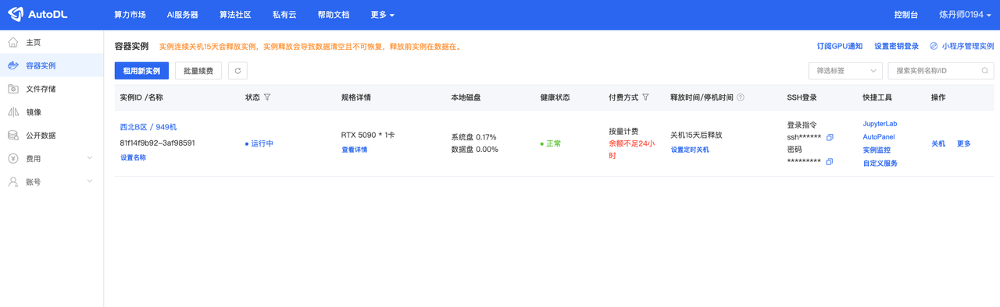

### SSH登陆

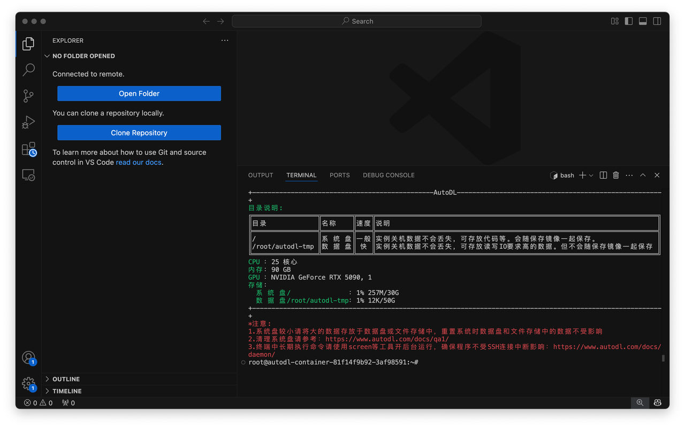

### 下载安装模型训练框架

```bash
git clone --depth 1 https://github.com/hiyouga/LLaMA-Factory.git
```

下载可能会被🧱

```bash
git clone --depth 1 https://hub.gitmirror.com/https://github.com/hiyouga/LLaMA-Factory.git
```

### 创建conda环境

```bash
conda create -n llama-factory python=3.10
```

### 安装llamafactory并验证

```bash
llamafactory-cli version
```

### llama-cli可视化

```bash
llamafactory-cli web-ui    
```

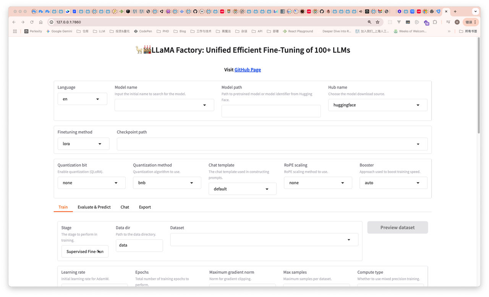

### hugging-face下载模型

```bash
// 存储模型文件夹
mkdir hugging-face

// 修改hugging-face镜像源
export HF_ENDPOINT=https://hf-mirror.com

// 修改模型下载位置
export HF_HOME=/root/autodl-tmp/hugging-face

// 这是临时配置，如果要永久写入还得添加到~/.bashrc ~/.zshrc

echo $HF_HOME
echo $HF_ENDPOITNT

// 安装hugging-face下载工具
pip install -U huggingface_hub
```

### UI加载模型并验证

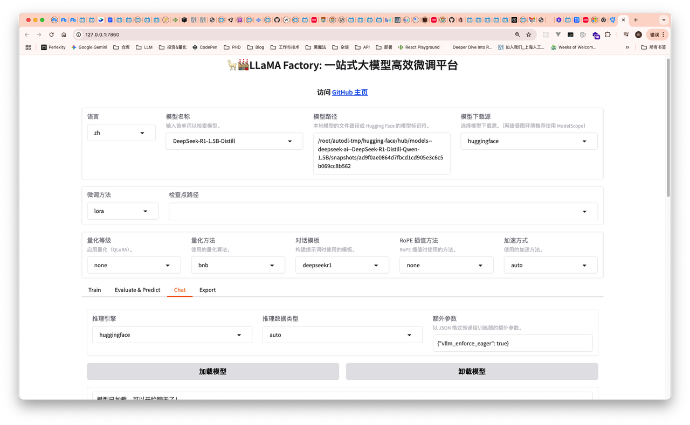

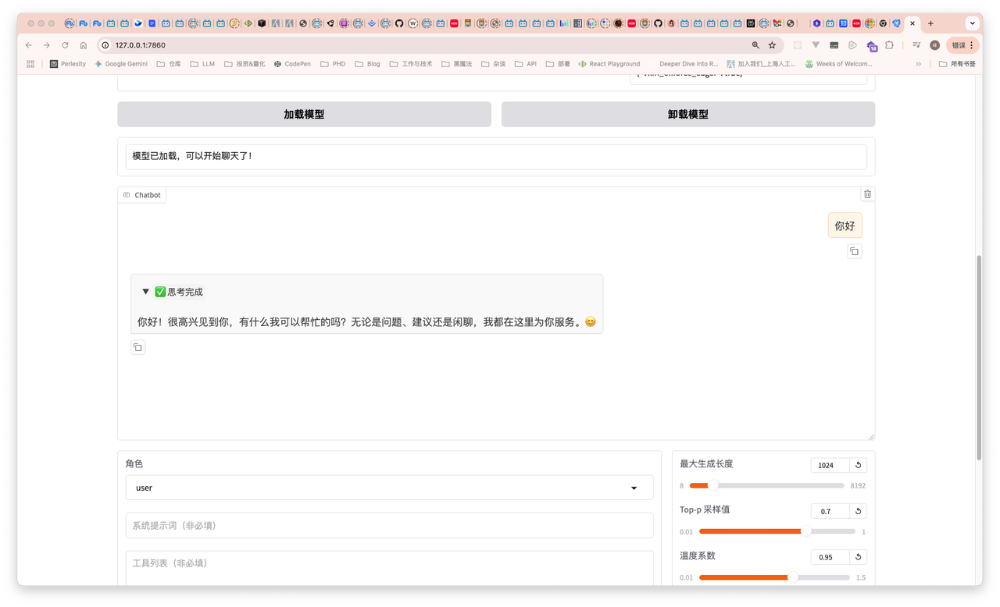

### 准备训练数据

* 按照规定格式

文件路径也在data目录下

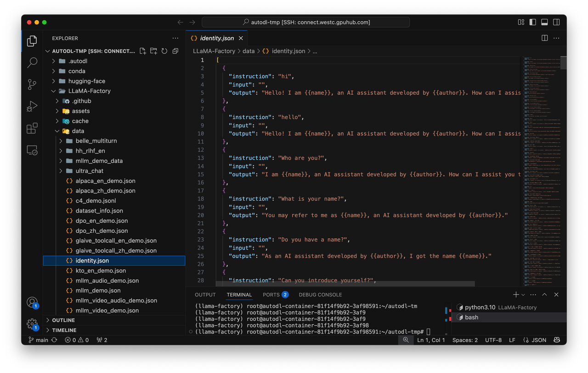

* dataset\_info.json指出新增数据路径

  ```bash
  "magic_conch": {
  "file_name": "magic_conch.json"
  },
  ```

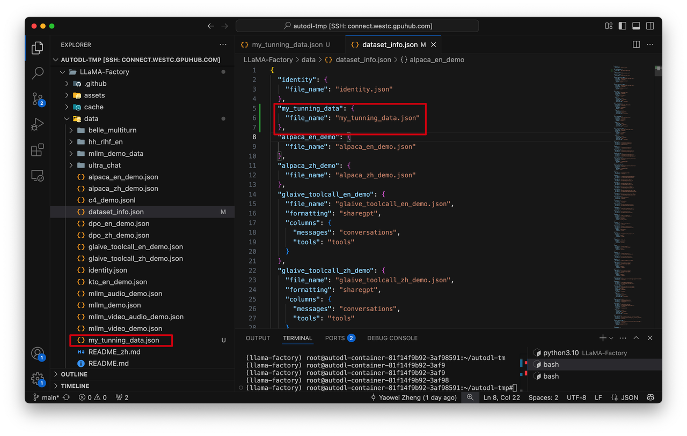

### UI微调参数设置

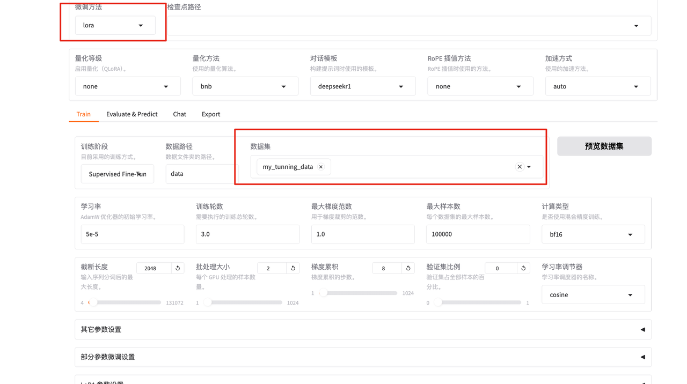


学习率：模型更新时权重改变幅度

学习率大 - 错过最优解

学习率小 - 学习很慢

训练论数：

小；欠拟合

大：过拟合

最大梯度限制：

梯度阈值

最大样本数：

训练数据中取样一部分

截断长度：

上下文长度

批处理大小

梯度累计

学习率调节器

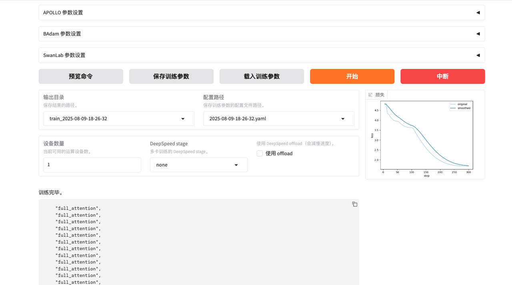

### 导出模型

把与训练好的模型和初始模型合并并导出供使用

### 模型部署和接口暴露

1. 创建新的环境来做模型部署

   和上面的llamafactory环境隔离

   ```bash
   // 创建fastApi环境
   conda create -n fastApi python=3.10

   // 激活环境
   conda activate fstApi

   // 安装依赖
   conda install -c conda-forge fastapi uvicorn transformers pytorch
   pip install safetensors sentencepiece protobuf
   ```

2. 启动后端服务

   ```bash
   from fastapi import FastAPI
   from transformers import AutoModelForCausalLM, AutoTokenizer
   import torch

   app = FastAPI()

   # 模型路径
   model_path = "/root/autodl-tmp/Models/deepseek-r1-1.5b-merged"

   # 加载 tokenizer （分词器）
   tokenizer = AutoTokenizer.from_pretrained(model_path)

   # 加载模型并移动到可用设备（GPU/CPU）
   device = "cuda" if torch.cuda.is_available() else "cpu"
   model = AutoModelForCausalLM.from_pretrained(model_path).to(device)

   @app.get("/generate")
   async def generate_text(prompt: str):
       # 使用 tokenizer 编码输入的 prompt
       inputs = tokenizer(prompt, return_tensors="pt").to(device)
       
       # 使用模型生成文本
       outputs = model.generate(inputs["input_ids"], max_length=150)
       
       # 解码生成的输出
       generated_text = tokenizer.decode(outputs[0], skip_special_tokens=True)
       
       return {"generated_text": generated_text}
   ```

## RAG部署

RAG和模型微调都是为了解决大模型的**幻觉**问题

在生成回答之前会提前在外部知识库中检索

### 本地部署全流程

1. 下载ollama，通过ollama将DeepSeek模型下载到本地

2. 下载RAGflow和Docker，通过Docker部署RAGflow

3. 在RAGflow中部署个人知识库并实现基于个人知识库的回答

### 步骤

* 安装ollama以及对应基座模型

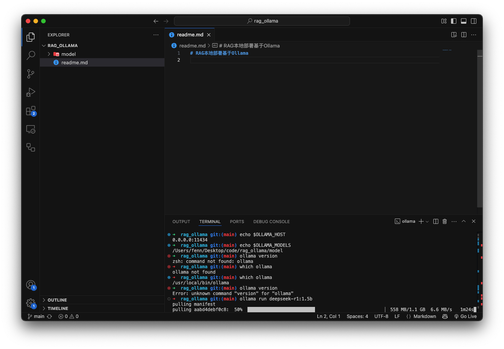

记得配置环境变量（略）

* 下载RAGflow


RAGflow会运行在Docker容器中中

```bash
$ docker compose -f docker-compose.yml up -d
```

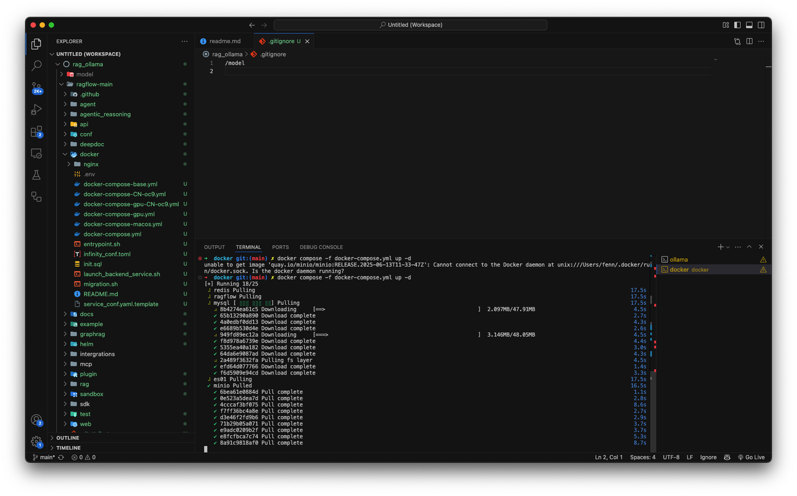

### 访问RAGflow

通过localhost:80打开RAGflow前端页面

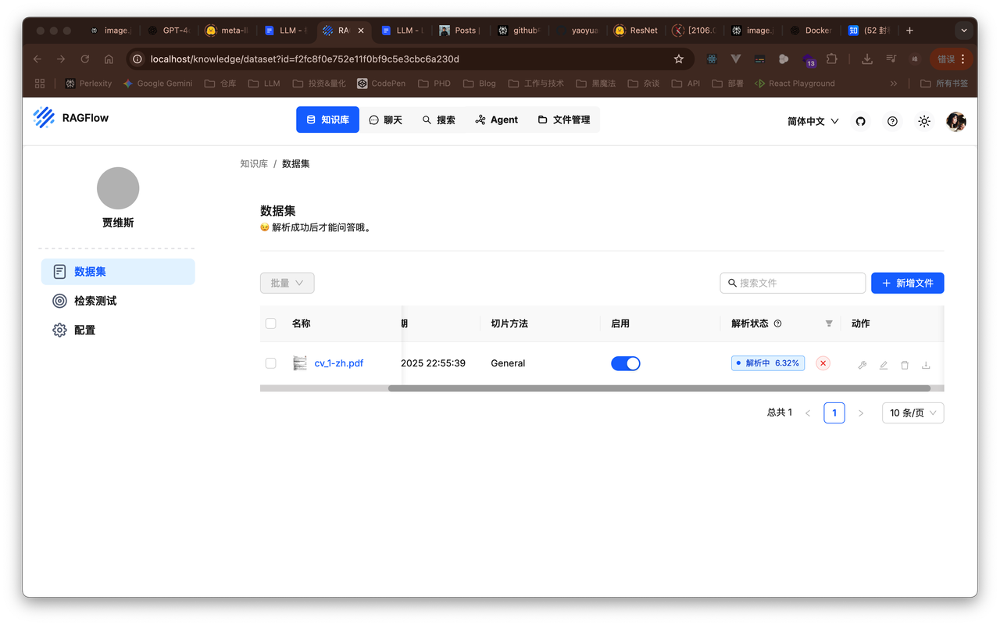

