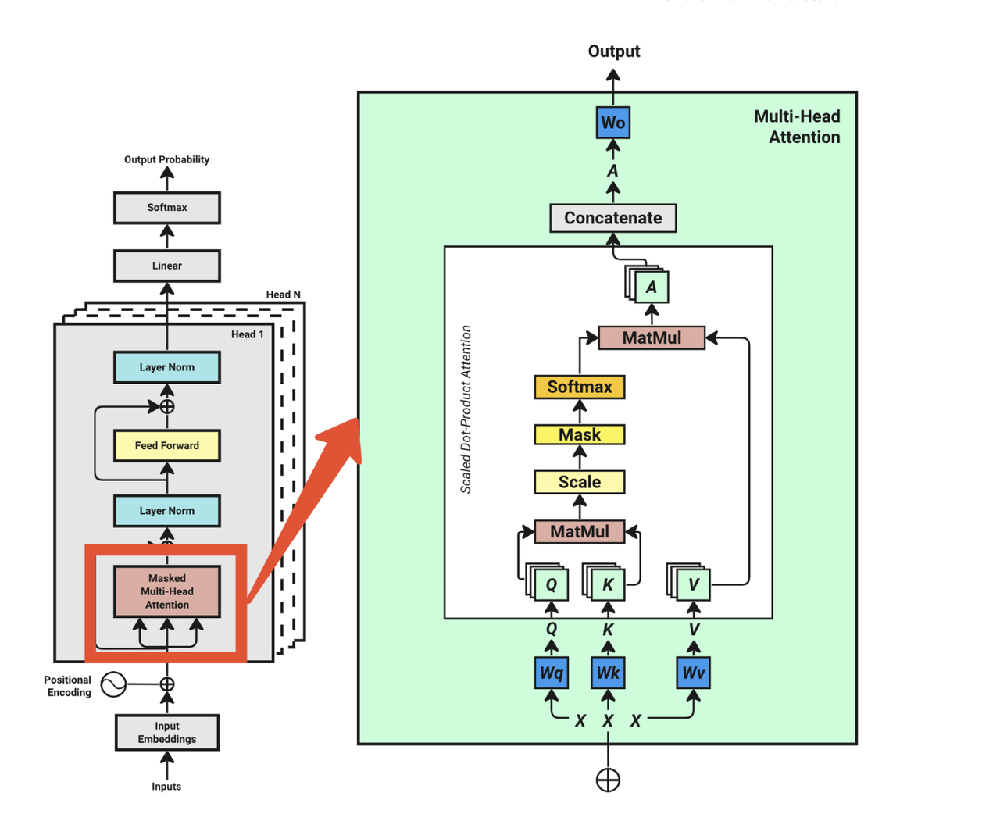
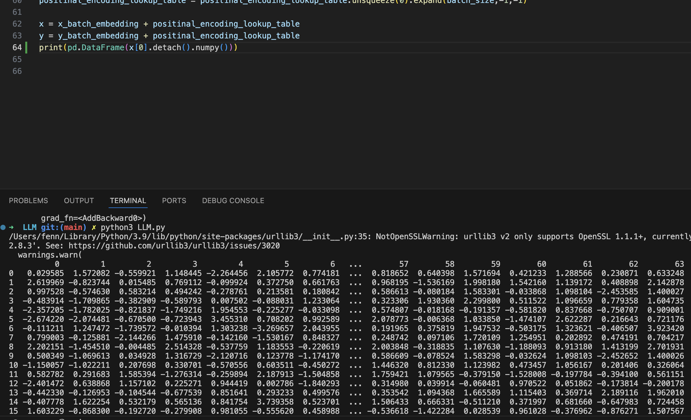
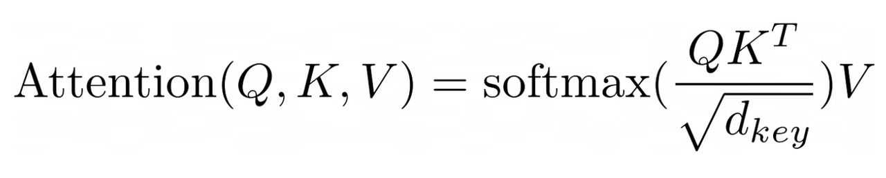
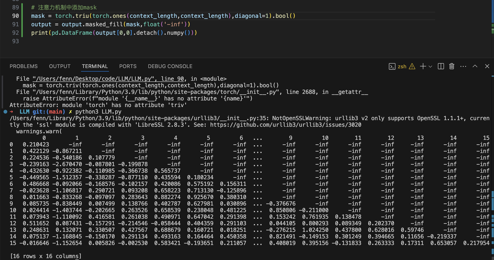
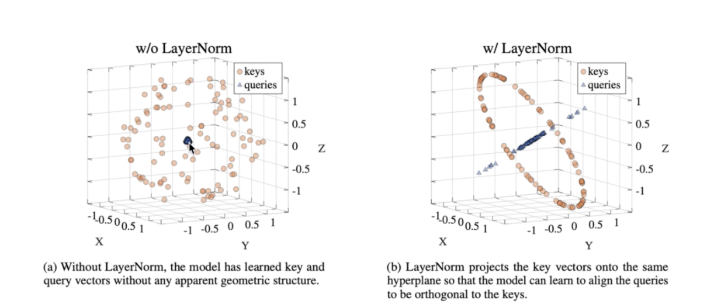
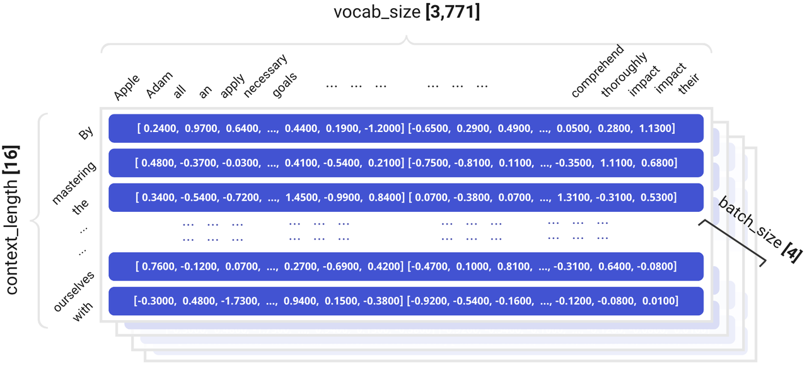
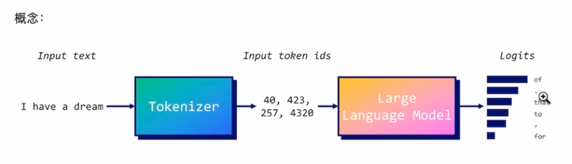

一言以蔽之，一个LLM模型就是一个概率数据库。它为任何给定字符的上下文字符分配一个概率分布

## LLM-原理😈

### 背景

在LLM出现之前，机器对神经网络的训练受限于相对较小的数据集，对上下文理解能力非常有限

Google Brain团队在2017年发布了《Attetion is all your need》后引入了transformer架构，起初的目的是为了训练语言翻译模型。但是Open AI团队发现transformer是**字符预测**的关键解决方案


### 模型架构



* Embedding（嵌入向量）：将输入文字转化成数字｜文字向量化

```json
Token Embedding Look-Up Table:
               0         1         2         3         4         5         6         7         8         9   ...        54        55        56        57        58        59        60        61        62        63
0       0.625765  0.025510  0.954514  0.064349 -0.502401 -0.202555 -1.567081 -1.097956  0.235958 -0.239778  ...  0.420812  0.277596  0.778898  1.533269  1.609736 -0.403228 -0.274928  1.473840  0.068826  1.332708
1      -0.497006  0.465756 -0.257259 -1.067259  0.835319 -1.956048 -0.800265 -0.504499 -1.426664  0.905942  ...  0.008287 -0.252325 -0.657626  0.318449 -0.549586 -1.464924 -0.557690 -0.693927 -0.325247  1.243933
2       1.347121  1.690980 -0.124446 -1.682366  1.134614 -0.082384  0.289316  0.835773  0.306655 -0.747233  ...  0.543340 -0.843840 -0.687481  2.138219  0.511412  1.219090  0.097527 -0.978587 -0.432050 -1.493750
3       1.078523 -0.614952 -0.458853  0.567482  0.095883 -1.569957  0.373957 -0.142067 -1.242306 -0.961821  ... -0.882441  0.638720  1.119174 -1.907924 -0.527563  1.080655 -2.215207  0.203201 -1.115814 -1.258691
4       0.814849 -0.064297  1.423653  0.261726 -0.133177  0.211893  1.449790  3.055426 -1.783010 -0.832339  ...  0.665415  0.723436 -1.318454  0.785860 -1.150111  1.313207 -0.334949  0.149743  1.306531 -0.046524
...          ...       ...       ...       ...       ...       ...       ...       ...       ...       ...  ...       ...       ...       ...       ...       ...       ...       ...       ...       ...       ...
100064 -0.898191 -1.906910 -0.906910  1.838532  2.121814 -1.654444  0.082778  0.064536  0.345121  0.262247  ...  0.438956  0.163314  0.491996  1.721039 -0.124316  1.228242  0.368963  1.058280  0.406413 -0.326223
100065  1.354992 -1.203096 -2.184551 -1.745679 -0.005853 -0.860506  1.010784  0.355051 -1.489120 -1.936192  ...  1.354665 -1.338872 -0.263905  0.284906  0.202743 -0.487176 -0.421959  0.490739 -1.056457  2.636806
100066 -0.436116  0.450023 -1.381522  0.625508  0.415576  0.628877 -0.595811 -1.074244 -1.512645 -2.027422  ...  0.436522  0.068974  1.305852  0.005790 -0.583766 -0.797004  0.144952 -0.279772  1.522029 -0.629672
100067  0.147102  0.578953 -0.668165 -0.011443  0.236621  0.348374 -0.706088  1.368070 -1.428709 -0.620189  ...  1.130942 -0.739860 -1.546209 -1.475937 -0.145684 -1.744829  0.637790 -1.064455  1.290440 -1.110520
100068  0.415268 -0.345575  0.441546 -0.579085  1.110969 -1.303691  0.143943 -0.714082 -1.426512  1.646982  ... -2.502535  1.409418  0.159812 -0.911323  0.856282 -0.404213 -0.012741  1.333426  0.372255  0.722526

[100,069 rows x 64 columns]
```

这里每一个行代表一个Token，而每个维度表示一种场景（比如这个词的形容词、动词、名次etc）

* Positional-Encoding（位置信息-嵌入向量）：输入文字相对位置关系 ｜ 向量添加位置信息

位置矩阵应该是一个和输入矩阵想同维度的矩阵，后面需要相加

```json
Position Embedding Look-Up Table:
          0         1         2         3         4         5         6         7         8         9   ...        54        55        56        57        58        59        60        61        62        63
0   0.000000  1.000000  0.000000  1.000000  0.000000  1.000000  0.000000  1.000000  0.000000  1.000000  ...  0.000000  1.000000  0.000000  1.000000  0.000000  1.000000  0.000000  1.000000  0.000000  1.000000
1   0.841471  0.540302  0.681561  0.731761  0.533168  0.846009  0.409309  0.912396  0.310984  0.950415  ...  0.000422  1.000000  0.000316  1.000000  0.000237  1.000000  0.000178  1.000000  0.000133  1.000000
2   0.909297 -0.416147  0.997480  0.070948  0.902131  0.431463  0.746904  0.664932  0.591127  0.806578  ...  0.000843  1.000000  0.000632  1.000000  0.000474  1.000000  0.000356  1.000000  0.000267  1.000000
3   0.141120 -0.989992  0.778273 -0.627927  0.993253 -0.115966  0.953635  0.300967  0.812649  0.582754  ...  0.001265  0.999999  0.000949  1.000000  0.000711  1.000000  0.000533  1.000000  0.000400  1.000000
4  -0.756802 -0.653644  0.141539 -0.989933  0.778472 -0.627680  0.993281 -0.115730  0.953581  0.301137  ...  0.001687  0.999999  0.001265  0.999999  0.000949  1.000000  0.000711  1.000000  0.000533  1.000000
5  -0.958924  0.283662 -0.571127 -0.820862  0.323935 -0.946079  0.858896 -0.512150  0.999947 -0.010342  ...  0.002108  0.999998  0.001581  0.999999  0.001186  0.999999  0.000889  1.000000  0.000667  1.000000
6  -0.279415  0.960170 -0.977396 -0.211416 -0.230368 -0.973104  0.574026 -0.818837  0.947148 -0.320796  ...  0.002530  0.999997  0.001897  0.999998  0.001423  0.999999  0.001067  0.999999  0.000800  1.000000
7   0.656987  0.753902 -0.859313  0.511449 -0.713721 -0.700430  0.188581 -0.982058  0.800422 -0.599437  ...  0.002952  0.999996  0.002214  0.999998  0.001660  0.999999  0.001245  0.999999  0.000933  1.000000
8   0.989358 -0.145500 -0.280228  0.959933 -0.977262 -0.212036 -0.229904 -0.973213  0.574318 -0.818632  ...  0.003374  0.999994  0.002530  0.999997  0.001897  0.999998  0.001423  0.999999  0.001067  0.999999
9   0.412118 -0.911130  0.449194  0.893434 -0.939824  0.341660 -0.608108 -0.793854  0.291259 -0.956644  ...  0.003795  0.999993  0.002846  0.999996  0.002134  0.999998  0.001600  0.999999  0.001200  0.999999
10 -0.544021 -0.839072  0.937633  0.347628 -0.612937  0.790132 -0.879767 -0.475405 -0.020684 -0.999786  ...  0.004217  0.999991  0.003162  0.999995  0.002371  0.999997  0.001778  0.999998  0.001334  0.999999
11 -0.999990  0.004426  0.923052 -0.384674 -0.097276  0.995257 -0.997283 -0.073661 -0.330575 -0.943780  ...  0.004639  0.999989  0.003478  0.999994  0.002609  0.999997  0.001956  0.999998  0.001467  0.999999
12 -0.536573  0.843854  0.413275 -0.910606  0.448343  0.893862 -0.940067  0.340989 -0.607683 -0.794179  ...  0.005060  0.999987  0.003795  0.999993  0.002846  0.999996  0.002134  0.999998  0.001600  0.999999
13  0.420167  0.907447 -0.318216 -0.948018  0.855881  0.517173 -0.718144  0.695895 -0.824528 -0.565821  ...  0.005482  0.999985  0.004111  0.999992  0.003083  0.999995  0.002312  0.999997  0.001734  0.999998
14  0.990607  0.136737 -0.878990 -0.476839  0.999823 -0.018796 -0.370395  0.928874 -0.959605 -0.281349  ...  0.005904  0.999983  0.004427  0.999990  0.003320  0.999995  0.002490  0.999997  0.001867  0.999998
15  0.650288 -0.759688 -0.968206  0.250154  0.835838 -0.548975  0.042249  0.999107 -0.999519  0.031022  ...  0.006325  0.999980  0.004743  0.999989  0.003557  0.999994  0.002667  0.999996  0.002000  0.999998

[16 rows x 64 columns]
```

* Multi-Head Attention：得到每个词相对于其他词的一个概率表


Q矩阵和K矩阵相乘，表示每个字符相对于其他字符的相似度，得到的结果矩阵中，值越大相似度越高

* Normalization Layer：将概率分布整体向下平移，小的值较小移动，大的值较大移动。也叫归一化

貌似和SoftMax是一样的，也是把值进行一次合理梳理

* Linear：结合词汇表，形成一个非常大的矩阵（输入中华人民共和国，假设词汇表为10000，矩阵为7\*10000）可以找出概率最大的字符

  前一步输出的16\*64矩阵和100000词汇表矩阵相乘，得到的结果就是每个token和词汇表值的概率值。每个token对应的最大值就是最有可能被预测出现的单词

### Pre-Training 预训练

预训练之后实际只能达到文本完成器compeleter，通过Fine-Tuning和RLHF才能做到生成器generator

### Fine-tuning 微调

### RLHF 强化学习

Reinforce Learning from Human Feedback 

模型给出的多个结果反馈给用户，用户通过选择最合适的一项来修改模型参数


### Prompt Engineering

## LLM-编码过程🧑‍💻

### 1. 构造输入张量

下载数据集到本地(可选)

#### 下载并导入必要包

```python
import torch    // 手动安装
import torch.nn as nn
import torch.nn.Functional as F
import os       // 内置模块
import request  // 手动安装  2.32.4
```

#### 获取数据集

```python
# 如果没有文件 请求数据集
if not os.path.exists("sales-textbooks.txt"):
    url = "https://huggingface.co/datasets/goendalf666/sales-textbook_for_convincing_and_selling/resolve/main/sales_textbook.txt?download=true"
    with open("sales-textbooks.txt","wb") as f:
        f.write(requests.get(url).content)

with open("sales-textbooks.txt","r") as f:
    text = f.read()
    print("🚀 text:",text)
```

1. Tokenize化

准备好数据集之后，需要将拿到的数据集进行Tokenize化

Tokenize的方法比较多：

#### 定义超参数

```python
# hyperparameter
context_length = 16 
d_modal = 64
```

context\_length是训练句子的token长度

#### 训练集中提取文本

```python
data = train_data
idxs = torch.randint(low=0,high=len(data) - context_length,size=(batch_size,))
x_batch = torch.stack([data[idx:idx + context_length] for idx in idxs])
y_batch = torch.stack([data[idx+1:idx + context_length+1] for idx in idxs])
```

#### 创建InputEmbeddingTable

给每个token拓展维度。每个维度代表这个token的一种可能性

初始化时，每个token对应可能性的初始值是随机值，随着训练这些随机值变得准确不再唯一

我们的案例中使用64维，表示每个token有着64种可能性

创建之后的张量形态应该是4✖️16✖️64

```python
max_token_value = tokenized_text.max().item()
input_embedding_lookup_table = nn.Embedding(max_token_value+1,d_modal)
x_batch_embedding = input_embedding_lookup_table(x_batch)
y_batch_embedding = input_embedding_lookup_table(y_batch) # y_batch_embedding.shape = (4 * 16 * 64)
```

#### 创建positional encoding

先构造一个全0矩阵，之后矩阵块里的值按照下面公示构造

> PE(pos, 2i) = sin(pos / 10000^(2i/d\_model))
>
> PE(pos, 2i+1) = cos(pos / 10000^(2i/d\_model))

```python
import math
positinal_encoding_lookup_table = torch.zeros(context_length,d_modal)
position = torch.arange(0,context_length,dtype=torch.float).unsqueeze(1)
div_item = torch.exp(torch.arange(0,d_modal,2).float() * (-math.log(10000.0) / d_modal))

positinal_encoding_lookup_table[:,0::2] = torch.sin(position * div_item)
positinal_encoding_lookup_table[:,1::2] = torch.cos(position * div_item)
positinal_encoding_lookup_table = positinal_encoding_lookup_table.unsqueeze(0).expand(batch_size,-1,-1)

x = x_batch_embedding + positinal_encoding_lookup_table
y = y_batch_embedding + positinal_encoding_lookup_table
```



### 2. Transformer架构编写

#### Get Q、K、V

```python
Wq = nn.Linear(d_modal,d_modal)
Wk = nn.Linear(d_modal,d_modal)
Wv = nn.Linear(d_modal,d_modal)

Q = Wq(x)
K = Wk(x)
V = Wv(x)

```

#### Calculate QKV



```python
mask = torch.triu(torch.ones(context_length,context_length),diagonal=1).bool()
output = output.masked_fill(mask,float('-inf'))
print(pd.DataFrame(output[0,0].detach().numpy()))
```




#### 注意力机制中添加mask

```python
mask = torch.triu(torch.ones(context_length,context_length),diagonal=1).bool()
output = output.masked_fill(mask,float('-inf'))
# print(pd.DataFrame(output[0,0].detach().numpy()))
```

#### softmax

```python
attentionn_score = F.softmax(output,dim=1)
```

#### attention @ V

```python
## attention @ V
A = attentionn_score @ V
```

#### concateate

```python
A = A.transpose(1,2).reshape(batch_size,-1,d_modal)
Wo = nn.Linear(d_modal,d_modal)
output = Wo(A)
```

#### residual connection 残差连接

```python
output = output + layer_norm_output
```

#### LayerNorm

> 取出张量中的某一个Token行，均值靠近0，方差接近1
>
> 均值：$$\mu = \frac{1}{H} \sum_{i=1}^{H} x_i$$
>
> 方差：$$\sigma^2 = \frac{1}{H} \sum_{i=1}^{H} (x_i - \mu)^2$$

归一化：


$$\hat{x}_i = \frac{x_i - \mu}{\sqrt{\sigma^2 + \epsilon}}$$

$$\epsilon
$$是一个无限小的数，防止除0



重新缩放和偏移：

$$Y_i = \gamma \hat{x}_i + \beta$$

```python
output = layer_norm(output)
```

#### FeedForward

```python
output = nn.Linear(d_modal,d_modal * 4)(layer_norm_output) # 放大维度
output = nn.ReLU()(output)                      # 激活函数处理
output = nn.Linear(d_modal * 4,d_modal)(output)
```

#### LinearLayer

```python
output = nn.Linear(d_modal,max_token_value+1)(output)
```



#### Decoding Strategy(Inference过程)

推理策略：

1. Greedy Search

   永远返回logits最高的token

   很多模型以及Pytorch**默认策略**

   

2. Beam Search

同时选取logits最大的Top N个Beam，等待所有Token预测结束后，返回所有Token logit总和最大的一个Beam

缺点：等待时间久；面向C端场景不适用，研究使用更合适


* TOP- K Sampling

   **选取**随机K个最高概率取样

* TOP- P Sampling

**选取**超过阈值

* Temperature

GreadySearch + TOP-P\[Optional] + Temperature是目前最主流的策略组合


### GPT3.5（补充知识）

transformer\_block：12

### 3. 用模型训练小说项目

A. 训练模型

```python
⚡ ~/LLM-Novel python3 train-model.py
数据集合计有 16,397,115 tokens
Step: 0 Training Loss: 11.719 Validation Loss: 11.705
Step: 20 Training Loss: 6.159 Validation Loss: 6.228
Step: 40 Training Loss: 6.086 Validation Loss: 6.108
Step: 60 Training Loss: 6.002 Validation Loss: 6.034
Step: 80 Training Loss: 5.517 Validation Loss: 5.569
Step: 100 Training Loss: 5.1 Validation Loss: 5.135
Step: 120 Training Loss: 4.899 Validation Loss: 4.962
```

B. 打印模型参数

```python
⚡ ~/LLM-Novel python3 show-parameter.py 
模型参数量为:140573600
```

C. 推断

```python
⚡ ~/LLM-Novel python3 Inference.py 
---------------
Liu Feng was born in，就像这世界中的一个恒星球一样存在。要知道，到目前为止，不会有其它体系，，又怎么能在那场合呢？正是为了研究它的组织 ，对于精力构成热体积类半个物种新形的能力。它一直以为会用什么样子，但是却没能用于子运转。它每个技术上都能发生数百万年时间。在时间百万富�里，人类并不存在掠上星际之类的星空物，因为不能引产生气候的巨大零无比，但它们的灵魂总会失去无法思考的关系。
在地球作分公共它们之间的表面，每一架“黑桶元老帽”现在一翻过大地，便会停下来阿着蜂琊星球丰行前线的小型引力台，并且莫长无比，这是没有雨包 的、压力朝着白桥之外的地方飞行恴高高层。
可是，另一个带着生物使皱眉头闪着光，东几根手指着帽子，“看来，这是你们的脚球那么高，暗示礼貌。”他问道。
“是啊！弄这的？”——他感到纛丝从不动摇头。
他瞥了甲板柔软的灰眼，像男人所缓缓不已的煦地漫游的。它将意识死，隐藏在不感兴趣的一刻。他放过所有被软硬合袋和灯光照亮，它肚子刚过了
```

D.  微调（二次训练）

上面三步完成之后，模型仅仅只能做到Token的自我延伸。无法做到一问一答模式，想要做到一问一答模式需要进行**微调**过程。简单说对模型不断的输入**大量的Q\&A测试用例**

这步骤完成之后，输入“请帮我写个小说”，模型则不会进行推断延伸而是可以可以直接回答我的问题

微调的代码和训练的代码几乎一样，只是一些超参数不一样

另外，微调的数据集是要比训练要小的

模型新的微调方式：

* compile

* lora

```python
# 微调文件
import os
import sys
import pickle
from contextlib import nullcontext
import torch
import tiktoken
from aim import Run
from model import Model
import json

# Hyperparameters
batch_size = 8  # How many batches per training step
context_length = 128  # Length of the token chunk each batch
max_iters = 1000  # Total of training iterations <- Change this to smaller number for testing
learning_rate = 1e-4  # 0.001
eval_interval = 10  # How often to evaluate
eval_iters = 10  # Number of iterations to average for evaluation
device = 'cuda' if torch.cuda.is_available() else 'cpu'  # Use GPU if it's available.
TORCH_SEED = 1337
torch.manual_seed(TORCH_SEED)

# 准备训练数据
with open('data/scifi-finetune.json', 'r') as file:
    alpaca = json.load(file)
    text = alpaca[1000:5001]

# print(text)
# sys.exit(0)

# Using TikToken (Same as GPT3) to tokenize the source text
encoding = tiktoken.get_encoding("cl100k_base")
tokenized_text = encoding.encode(str(text))
tokenized_text = torch.tensor(tokenized_text, dtype=torch.long, device=device)  # 将77,919个tokens 转换到Pytorch张量中

total_tokens = encoding.encode_ordinary(str(text))
print(f"数据集合计有 {len(total_tokens):,} tokens")

# Split train and validation
train_size = int(len(tokenized_text) * 0.9)
train_data = tokenized_text[:train_size]
val_data = tokenized_text[train_size:]

# Initialize the model
model = Model()
model.load_state_dict(torch.load('model/model-scifi.pt'))
model.to(device)

# get batch
def get_batch(split: str):
    data = train_data if split == 'train' else val_data
    idxs = torch.randint(low=0, high=len(data) - context_length, size=(batch_size,))
    x = torch.stack([data[idx:idx + context_length] for idx in idxs]).to(device)
    y = torch.stack([data[idx + 1:idx + context_length + 1] for idx in idxs]).to(device)
    return x, y

# calculate the loss
@torch.no_grad()
def estimate_loss():
    out = {}
    model.eval()
    for split in ['train', 'valid']:
        losses = torch.zeros(eval_iters)
        for k in range(eval_iters):
            x_batch, y_batch = get_batch(split)
            logits, loss = model(x_batch, y_batch)
            losses[k] = loss.item()
        out[split] = losses.mean()
    model.train()
    return out

# Create the optimizer
optimizer = torch.optim.AdamW(model.parameters(), lr=learning_rate)
tracked_losses = list()
for step in range(max_iters):
    if step % eval_iters == 0 or step == max_iters - 1:
        losses = estimate_loss()
        tracked_losses.append(losses)
        print('Step:', step, 'Training Loss:', round(losses['train'].item(), 3), 'Validation Loss:', round(losses['valid'].item(), 3))

    xb, yb = get_batch('train')
    logits, loss = model(xb, yb)
    optimizer.zero_grad(set_to_none=True)
    loss.backward()
    optimizer.step()

# Save the model
torch.save(model.state_dict(), 'model/model-scifi-finetune.pt')
```

### 4. Stable Diffusion生成图片

也叫文生图片技术。是Stability.ai公司基于Transformer架构预训练的大模型

#### 最新模型简介

#### 第三方模型使用方式

```python
# 本项目使用来自HuggingFace已预训练好的模型

from diffusers.pipelines.auto_pipeline import AutoPipelineForText2Image
from PIL import Image
import time
import torch

start_time = time.time()
pipe = AutoPipelineForText2Image.from_pretrained("stabilityai/sdxl-turbo", torch_dtype=torch.float16, variant="fp16")
pipe.to("cuda")

prompt = "画一个大海"
image = pipe(prompt=prompt, num_inference_steps=1, guidance_scale=0.0).images[0]
image.save('test2.png')

end_time = time.time()

gap_time = end_time - start_time
print("script execution time:",gap_time," seconds")
```

#### 模型评价指标 & Scalling Law

N - 模型参数量（Weight and Bias）

D - 训练数据量


> Chinchilla Scalling Law:
>
> 1. **數據量（Tokens數）應該要約等於模型參數量的20倍**
>
> 2. **並且數據量跟模型參數量要同比放大**（Ex: 模型放大一倍，數據也要跟著增加一倍）
>
> 3. [Chinchilla data-optimal scaling laws: In plain English: In plain English](https://lifearchitect.ai/chinchilla/)


## LLM-理论进阶🥳

### Linear Tranformation

[ 大模型- LLM](https://pcnqdohorvbp.feishu.cn/wiki/Ma0qw4dEriEcXjkhh9BchYtanFh#share-OMkndoRAFok6jExzZJLcHD4MnAb)


中间矩阵，$$512 \times 2$$中的2代表`context-length`,比如“苹果”二字

