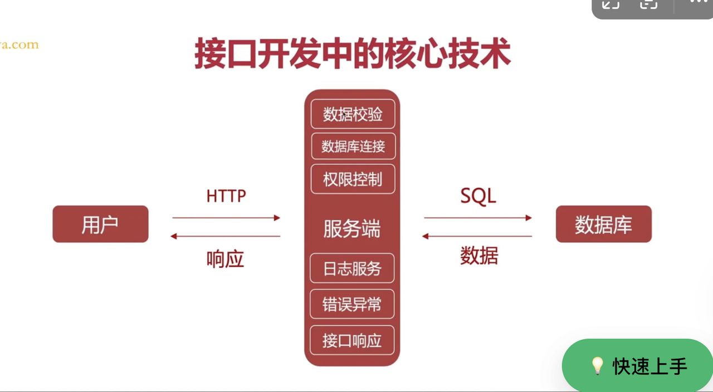

* 数据库

* 日志

* 异常

* 权限

* 校验

* ...



### NodeJs缺陷

* 由于天生单线程特性，面对CPU密集型任务，可能会导致性能瓶颈

从性能来看：`Bun > Deno > Node`

* Deno和Bun天生支持Typescript

* Deno增加了权限模型，更安全

### Node线程

* libuv线程池

处理IO密集型任务

* worker\_threads

处理计算密集型任务

### Worker\_threads

Node.js 10.x 版本开始，引入了 `worker_threads` 模块，着重处理CPU密集型任务

Nodejs默认只有一个JS线程，但是可以创建多个JS线程辅助计算。使用 `worker_threads` 可以实现真正意义上的多线程并行计算

现代操作系统的线程调度器可以将不同的线程分配到不同的 CPU 核心上并行执行

线程不直接共享内存，每个threads有自己的`v8引擎`；通过`postMessage`传递数据，实际上就是传统的跨进程数据传递方式

JS的线程不和其他多线程语言一样，比如go语言线程之间天然共享内存。

### Node的进程和线程

```javascript
// 进程
const cluster = require("cluster")
culster.fork() // 开启进程
// 线程
const {Worker} = require("worker_threads")
const worker1 = new Worker(地址)
```

### NodeJS架构

Node分为4大部分，`Node standard library`，`Node bindings`，`V8`和`libuv`

Node bindings：封装C++和JS的桥梁，封装V8和libuv


### NodeJs运行时


缺点：一旦某个计算过程崩溃，整个服务就崩溃

### BFF架构


服务端和服务端之间没有并发限制

### 中间件的洋葱模型

Koa/MidwayJs中的中间件使用**洋葱模型**；Express则是**队列模型**

```javascript
// myKoa.js
const {createServer} from 'http'
class MyKoa{
  handlerList = []
  use(fn){
    this.handlerList.push(fn)
  }
  _excute(){
    if(this.handlerList.length === 0) return
    const firstHandler = this.handler.shift()
    firstHandler(ctx,()=>{
      return this._excute()
    })
  }
  listen(port,callback){
    createServer((req,res)=>{
      req.write()
      _excute()
      res.write()
    })
  }
}
const app = new MyKoa()
app.use((ctx,next)=>{
  // ...
  next()
  // ...
})
app.listen(8001,()=>{
  
})
```

### libuv

非阻塞IO和事件循环得益于libuv

### 开启Node进程

* fork方式

```javascript
// index.js
const http = require("http")
const fork = require("child_process").fork
const server = http.createServer((req,res) =>{
  if(req.url === "/get-sum"){
    const childProcess = fork("./childProcess.js")
    childProcess.on("message",data=>{
      res.send(data)
    })
  }
})
server.listen(3000,()=>{
  console.info("localhost:3000")
})
// childProcess.js
function childFork(){
  let sum = 0
  for(let i = 0; i<10000;i++){
    sum += i
  }
}
 process.on("message",data=>{
    const sum = childFork()
    console.log("子进程id:",process.id)
    process.send(sum)
  })
```

* cluster方式


### JS-Bridge

JS不能调用native api，比如微信api。使用JS-Bridge就可以调用了。

* URL scheme （补充异步方案）

* 注册全局API （无法处理异步问题）


### 非阻塞

Node作为一种单线程环境，为什么却有高并发？


Node单线程指的是只有一个线程处理JS代码，但是会有其他线程处理IO操作


如果写了死循环，调用栈无法清空


高并发的秘诀就是，凭借**异步模块⚠️**和**事件循环**达到高并发，将耗时操作**清除出调用栈**，异步模块是多线程，事件循环发现耗时操作执行完成后，会把对应的`回调函数放回调用栈`

### CommonJS和ESmodule

* CJS是值传递；ESM是引用传递

* CJS运行时加载；ESM`预编译`


CommonJS运行时加载


### stream流模式

这是一个底层模块，平时几乎不会单独使用这个模块，但是也需要了解一下

* 缓冲模式

与流模式对应的就是缓冲模式，也叫传统模式

数据从磁盘**全部加载到内存**后，CPU进行全部数据的处理

* 流模式

流模式则是数据从磁盘部分加载到内存中，CPU就会进行处理，加载一点处理一点，将资源切分成小块。优点：占用的内存更小；调用端可以更快得到响应 总的来说就是高效

* 可读流

* 可写流

* 双工流


流之间的交互上，引用了pipe管道的概念

一般情况下，流对象只处理字符串和buffer，并不是直接处理js对象。流更常见于处理原始数据，比如字符串或者二进制，如果遇到处理js对象的场景，通常需要把js对象序列化和反序列化处理

```javascript
// 需求：存储来自前端的一张图片到本地
const http = require("http")
const fs = require("fs")
// req 本质就是readable
const server = http.createServer((req,res) => {
    // 创建可写流
    const w = fs.createWriteStream("./x.jpg")
    req.on("data", (chunk) => {
        w.write(chunk)
    })
    req.on("end", () => {
        w.end()
        res.end("图片保存完成")
    })
    req.on("error", (err) => {
        console.log(err)
        res.end("图片保存失败")
    })
    // req.pipe(w)
    // req.end("图片保存成功")
    // pipeline是pipe的进阶版，当管道以及异常比较多的时候，非常方便高效
})
server.listen(3000)
```

### pipe管道

连接可读流到可写流，数据自动流入，不用重写\_read和\_write方法

### 转换流


### Nestjs生命周期


### DTO\&DAO


### 多环境配置

* dotenv

解析`.env`文件里的属性&所有属性挂载到`process.env`下

* config

### 数据校验

Nodejs常使用数据校验库`Joi`

```javascript
Joi.string().valid([3306,3307])
Joi.string().domain()
Joi.string().url()
```

### ORM\&TypeORM

作用：使用JS代替SQL语句

### 实例化和依赖注入

* 整个应用程序运行期间都可以使用，选&#x62E9;**`new实例化`；**&#x786E;保资源合理使用，更好管理创建和销毁，**`选择依赖注入`**，比如数据库连接对象就可以自动创建、销毁

* 依赖注入需要`对象解析依赖`和`实例化`，性能开销大；实例化性能开销小

### 切面编程&依赖注入


### 日志模块

pino

winston


### 监控Node内存泄漏

* 使用`process.MemoryUsage`进行初步检测

```javascript
setInterval(()=>{
  const memory = process.MemoryUsage()
    console.log(
RSS: ${memoryUsage.rss} bytes
);
    console.log(
Heap Total: ${memoryUsage.heapTotal} bytes
);
    console.log(
Heap Used: ${memoryUsage.heapUsed} bytes
);
    console.log(
External: ${memoryUsage.external} bytes
);
},5000)
```

如果发现`RSS`或`heapUsed`快速增长则可能存在内存泄漏

* 使用`heapDump`生成堆快照

通过对比不同时间点的`堆内存快照 heapSnapShot`

```javascript
npm install heapDump
const heapDump = require("heapDump")
// 在某个时间点生成堆快照
setTimeout(() => {
    heapdump.writeSnapshot('./heapdump-' + Date.now() + '.heapsnapshot');
}, 10000);
```

* Chrome Devtools分析堆快照

1. 将生成的堆快照文件导入到 Chrome DevTools 的 Memory 面板中进行分析。具体步骤如下：

   1. 打开 Chrome 浏览器，访问 `chrome://inspect`。

   2. 点击 “Open dedicated DevTools for Node” 打开 Node.js 的调试面板。

   3. 在 DevTools 中切换到 Memory 面板

   4. 点击 “Load” 按钮，选择之前生成的堆快照文件进行加载。

   5. 使用 DevTools 提供的分析工具，如 “Comparison” 模式，对比不同时间点的堆快照，找出哪些对象的数量在不断增加。

2. 也可以启动的时候使用`--inspect`模式，然后结合DevTools查看内存情况

核心还是生成heapSnapShot然后在Devtools里查看

* 使用`cilnic`进行性能分析

```bash
npm install clinic
clinic heapprofiler -- node your-app.js
```

会生成一份`堆内存分析报告`

### Node内存大小

默认Node内存大小是2GB，但是我们也可以手动设置Node大小 `node --max-old-space-size=4096 ./test.js`&#x20;

### Node应用注意⚠️

* 局部变量

程序执行结束且没有引用的时候就会消失，为了避免内存爆掉，尽量多使用局部变量

* 全局变量

一直会存活到程序执行结束

### PM2 进程管理工具

* 可以后台运行Node应用

* 自动重启Node应用

### Node 工程化工具 项目脚手架

Node可以在 `立项-开发调试-测试-构建-部署` 等环节都可以参与

```json
{
  "name": "test-project",
  "version": "1.0.0",
  "description": "A Vue.js project",
  "main": "src/main.js",
  "private": true,
  "type":"module",  node支持esm
  "bin":"index.js",
  "scripts": {
    "dev": "webpack-dev-server --inline --progress --config build/webpack.dev.conf.js",
  "dependencies": {
    "vue": "^2.5.2"
  },
  "devDependencies": {
    "autoprefixer": "^7.1.2",
    "babel-core": "^6.22.1",
    "babel-eslint": "^8.2.1",
    "babel-helper-vue-jsx-merge-props": "^2.0.3",
    "babel-jest": "^21.0.2",
  },
  "engines": {
    "node": ">= 6.0.0",
    "npm": ">= 3.0.0"
  },
  "browserslist": ["> 1%", "last 2 versions", "not ie <= 8"]
}
```

```javascript
#!/usr/bin/env node // 需要告诉环境
const require = require("commander") // webpack -v
const inquirer = require('inquirer');
const path = require('path');
const fs = require('fs');
const download = require('download-git-repo'); // 从git下载文件夹到本地
const chalk = require("chalk") // 上色
const ora = require("ora") // 下载转圈
const progress = require("progress") // 下载进度条
const command = require("command") // process.argv[]
import { Command } from "commander"
const program = new Command();
program.option("-a [num]", "this is a", (num) => {
console.log("u use -a and input " + num);
})
program.version("1.0.0");
program.command("init <name>").action((name) => {
console.log(name);
})
program.parse(process.argv);
// 定义交互式问题
const questions = [
    {
        type: "checkbox",
        message: "选择功能",
        // 键名
        name: "projectFeature",
        choices: [
            "babel",
            "webpack",
            "router"
        ]
    },
    {
        type: "input",
        message: "请输入项目名称",
        name: "projectName"
    },
    {
        type: "list",
        message: "选择项目类型",
        name: "projectType",
        choices: [
            "react",
            "vue"
        ]
    },
    {
        type: "confirm",
        message: "是否生成",
        // 键名
        name: "render"
    }
];
inquirer.prompt(questions).then((res) => {
    let _target = 'facebook/react';
    let _outputDir = path.resolve(process.cwd(), res.projectName);
    if (res.projectType === "vue") {
        _target = 'vuejs/vue';
    }
    try {
        fs.mkdirSync(_outputDir);
        download("github:" + _target, _outputDir, {}, function (err) {
            if (err) {
                console.error("下载失败:", err);
            } else {
                console.log("下载成功");
            }
        });
    } catch (error) {
        console.error("创建目录时出错:", error);
    }
});    
```

### Node 工程化工具 构建插件

编写插件主要是为了完成apply方法

```javascript
class myplugin {
    constructor(config) {
        this.config = config
    }
    apply(compiler) {
        //监听webpack的某个生命周期 emit打包完成 done打包结束 20duo
        compiler.hooks.emit.tap("myplugin", (compilation) => {
            console.log(compilation.assets['app2.421c.bundle.js'].source())
        })
        compiler.hooks.done.tap("myplugin", () => { // 已经生成了dist文件夹
        })
    }
}
module.exports = myplugin
//js加入一些的东西
//js-》插入一些东西
```

### Node 工程化 小工具开发

略

### Node 工程化 TurboFan优化

一些热点代码编译成机器码缓存使用

```javascript
node --trace-opt xxx.js
```


